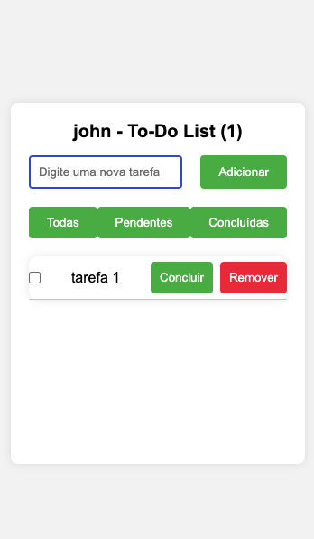

# 📝 React To-Do List

Aplicação de lista de tarefas desenvolvida com **React** para praticar Hooks, Context API e gerenciamento de estado.

---

## 📷 Preview



---

## 🚀 Funcionalidades

- ➕ Adicionar novas tarefas
- ✔️ Marcar tarefas como concluídas
- ❌ Remover tarefas
- 🔎 Filtrar tarefas:
  - Todas
  - Pendentes
  - Concluídas

---

## 🛠 Tecnologias utilizadas

- React
- JavaScript
- Context API
- Custom Hooks
- LocalStorage


---

## 📚 Conceitos aplicados

- useState
- useEffect
- Context API
- React.memo
- Hooks customizados
- Manipulação de listas com `map` e `filter`

---

## ▶️ Como executar o projeto

Clone o repositório:

```bash
git clone https://github.com/seu-usuario/seu-repositorio.git

cd nome-do-projeto

npm install

npm run dev


        src  
        ├── components  
        │   ├── ListaTarefas.jsx  
        │   ├── Tarefa.jsx  
        │   └── Login.jsx  

        ├── contexts  
        │   └── UserContext.jsx  

        ├── hooks  
        │   └── useInput.js  

        └── App.jsx  


👨‍💻 Autor

Desenvolvido por John Lima

LinkedIn: https://www.linkedin.com/in/john-fideles/     
